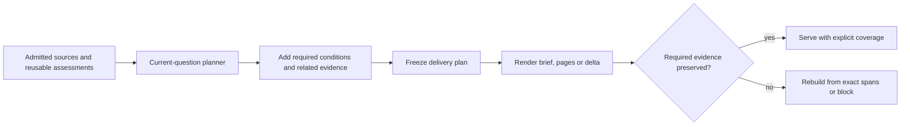

# Question-specific context delivery

Status: implemented and accepted for JCM 1.0.2, 2026-09-30. The representative
seven-flow evaluation preserved all 28 answers and primary gates in both execution
orders. Improved JCM brief/delta reduced combined consumer input by 14.0807%.
Uncached input increased by 1.1957%; this is not a monetary savings claim.
See [1.0.2 release and validation](releases/1.0.2.md) and the
[public consumer summary](../evidence/continuity-consumer-1.0.2.json).
The earlier separate experiment is recorded in
[context-delivery-validation.md](context-delivery-validation.md). The completed
implementation contract is [current-implementation-improvement.md](current-implementation-improvement.md).
The contract below records the implemented evidence boundary; acceptance is limited
to prepared-history consumer recovery and does not establish full historical
recovery, first indexing cost improvement or installed Desktop capture/hooks.

This refines the selection and delivery contracts in sections 9–11 of the
[original design](JCM_Astra_Continuity_Design_v1.0.md). The objective remains to
recover the right state for the current request with less Codex input, while
preserving applicable constraints, corrections, blockers and verification limits.
The current source journal, project scope and explicit deletion rules remain authoritative.
Historical commands never become current authorization.

## Problem and decision

Selection currently has multiple owners. The coordinator runs
`query_context.build`, then `core_context.plan/apply`, then
`representations.compact_brief`. A passage selected for the question can disappear
because the second stage defers native tool output by type. The final graph view
can then lose its assertion as well. No provider error is required for this loss.

The 2026-09-30 isolated reproduction selected a native tool's unique export
failure with a constraint judgment of 1.0. The final brief lost the failure while
both selection stages reported no errors. The original remained stored. Existing
live fixtures contained text-only tool records and bypassed this native branch.
See [core_context.py](../src/jcm/core_context.py),
[query_context.py](../src/jcm/query_context.py) and
[representations.py](../src/jcm/representations.py).

**One planner decides which exact evidence the current request needs. Everything
after that decision preserves it.** Presentation may reorder, factor shared
metadata, paginate or encode a delta; it may not independently defer a source.
This is a responsibility change inside existing modules, not a new agent,
service, storage engine or framework.



## Responsibility boundaries

| Stage | Owns | Must not do |
|---|---|---|
| Capture and source preparation | Admitted originals, native identity/status, exact spans, structural context, reusable body assessments | Delete or treat content as irrelevant because a process exited successfully |
| Task membership | Reusable scope, shared constraints, new/unassessed source coverage | Make every historical task member mandatory for every question |
| Current-question planner | Required spans, reasons, uncertainty and directly needed relations | Infer approval or current verification; omit an unassessed body solely from its descriptor |
| Evidence completion | Add conditions, original references and both sides of relevant unresolved relations | Resolve a conflict through recency or remove another required span |
| Renderer and delivery | Exact text, source identity, shared defaults, order, pages and delta encoding | Run a second relevance/report judgment or filter by role/native type |
| Consumer | Read required pages, reconcile current files, expand optional evidence when needed | Treat a receipt or recovered report as proof of implementation or model consumption |

`continuation` versus `evidence` remains a useful input to the planner's desired
detail level. It is not permission for a later stage to discard tool evidence.
An image result is not inherently required, and terminal output is not inherently
optional. The current question, concrete artifact and applicable conditions decide.

## Before selection: descriptors are not body assessments

The existing `detail_plan` can remove recognized successful tool bodies before
membership and question selection. Its descriptor establishes invocation status,
not absence of an important condition inside the output. A command with exit 0
can still report an incomplete export, invalid asset or unverified result.

Use descriptor information to order preparation and retrieve cached assessments.
It must not be the sole basis for a semantic deferral. A source can bypass a new
body assessment only when an applicable body-derived cached judgment covers the
exact source revision and current scope/question. Otherwise assess its structural
units through the existing Jev batching/cache path. Preserve an incomplete or
failed assessment as unresolved; do not convert it into a successful deferral.

Reuse the current worker, source classification, local index, split plans and
semantic cache. Do not add a background scope/relationship service in this change.
Request-independent preparation can be reused; current applicability still needs
the current request. No recent-N, top-N or daily-call cap substitutes for coverage.

## One delivery plan

Extend the existing `query_context.sources` entries rather than introducing a
second table or parallel selection store. The plan needs the following logical
information; field names are an implementation detail unless already public.

| Information | Contract |
|---|---|
| Binding | Current request, task identity, admitted source revisions, policy/model/question versions |
| Source decision | `keep`, `defer` or `unresolved`, with existing judgment references and a reason |
| Required evidence | Exact event/revision and character spans, including qualifications and structural context |
| Required state | Applicable constraints, corrections, unresolved relations and verification limits linked to those spans |
| Uncertainty | Specific missing assessment/source/condition; no implication that omission is safe |
| Presentation | Stable record order and provenance needed to distinguish current artifacts from similar older labels |

The full plan belongs in audit data. Codex receives the selected content, compact
provenance and concrete gaps. It does not need every probability, hash or internal
decision ID to perform its work.

### Compose narrow judgments in one place

Jev supplies semantic judgments; code owns the decision policy. Give each judgment
the current request, selected goal/artifact, exact passage, source origin and enough
surrounding context to interpret it. Ask independent questions together:

1. Does this passage provide information needed for the answer or next action?
2. Does it constrain or qualify that action or another included claim, including
   a blocker, negation, correction, incomplete result or unresolved conflict?
3. What available detail is needed for this request?

Keep the raw answers reusable and combine them under one versioned policy:

| Assessment | Plan result |
|---|---|
| Needed evidence or applicable qualification | Keep the exact relevant spans and their conditions |
| Conflicting answers, incomplete assessment or consequential uncertainty | Keep affected evidence with uncertainty; expand its context when necessary |
| Supported deferral, with no applicable qualification or dependency | Defer; retain an exact expansion path |
| Missing/invalidated/forbidden source | Report the specific gap or reject the pack; never reuse stale bytes to hide it |

The current `.8` relevance-deferral and `.2`–`.8` guard uncertainty thresholds are not established
general safety guarantees. Calibrate the combined policy against labeled native
cases, including ambiguous and conflicting answers. Do not lower thresholds to
restore a previous token-reduction percentage. A Noul near .5 is uncertainty
about the proposition, not evidence that a restriction is weak.

The `local-evidence-v2` policy refines uncertain qualification boundaries in
this planner. It supplies the exact unit, its actual parent conditions, the
current question and task identity. The current candidate policy combines the
three mutually exclusive boundary judgments as follows; these cutoffs remain
evaluation policy, not established recall guarantees.

- `independent >= .9` may remove only guard-driven inclusion, never an
  independently required claim.
- `local + independent >= .8` keeps the unit and its conditions. Keeping it
  covers both readings without claiming to have decided between them.
- A remaining distributed boundary keeps the selected exact unit and its
  structural conditions, with `qualification_limits` and the mandatory
  `qualification_boundary_policy` state. Its wider scope is unresolved;
  `complete_recovery_established` is false. A conclusion or action depending
  on that scope must inspect the enclosing source before proceeding.
- `source >= .8`, a missing or failed boundary assessment, or contradictory
  claim judgments retains the enclosing admitted source and explicit uncertainty.

An unresolved boundary is not permission to defer an independently required
claim, omit a known exception or declare full semantic recovery. The unresolved
state participates in the same required-evidence contract as exact source text.
Required-page completion only proves delivery of the frozen plan; it does not
resolve the plan's semantic uncertainty.

Reuse a valid whole-body judgment before refining JSON fields. Resolve an
uncertain whole-body qualification before field refinement;
only clearly independent artifact evidence may suppress that guard-driven work.
Keep needed claims even when the qualification is independent. Coalesce adjacent
fields with identical structural condition sets, retaining exact raw offsets.
This reduces repeated assessment of the same conditions without treating array
peers as one artifact or letting renderers select evidence again.

For nested transcript arrays, prefer a complete record when its assessment fits
the provider context, then descend into child records when needed. Send actual
parent conditions once in that item's state and reference them from its questions.
The model sees decoded evidence; raw characters, offsets and dependencies remain
part of the local judgment key and exact delivery contract. Confirmed context
rejections may split a source further, but a child must not retain a whole-parent
display string that prevents the request from shrinking.

Remove the independent assistant-report deferral too. A report may contain the
only remaining qualification. Its need is decided with the same query policy;
its provenance still identifies it as a historical report.

### Complete evidence before freezing the plan

For each retained claim, add the evidence needed to interpret it correctly:

- Parent identity/status/conditions for structured output, including nested
  conditions that a scalar-sibling heuristic cannot establish by itself.
- Negation, exception, scope and the unchanged clauses of a partial correction.
- Both exact assertions and their conditions for a relevant unresolved relation.
- Referenced originals and provenance needed to distinguish reported from
  observed information and separate artifacts with the same A/B/C labels.

Use exact source spans and known dependency edges. Where a condition's boundary
or relevance is unresolved, expand to its enclosing record/source or preserve a
specific gap. Structural paths alone do not prove that all semantic conditions
have been found. Do not join unrelated array records solely because they share a
container. Walk source references with a visited set; completion must terminate
on the finite admitted snapshot or report a missing dependency.

Decode nested JSON strings for assessment while mapping every retained unit back
to exact raw-source character offsets, including escaped Unicode and surrogate
pairs. Apply the same mapping to natural paragraphs embedded in a string. Other
paragraphs are independently assessed for qualifications; they are not all
structural parent conditions merely because they share that string. Identity,
status and actual enclosing conditions still accompany a retained paragraph.
An unparseable value stays whole. Reference presence alone does not make a
large copied wrapper mandatory: assess its body and follow references intersecting
the retained evidence and conditions. Preserve the source relation and any newly
required conditions; do not revive references found only in deferred spans.

This step may add evidence, not demote a retained unit. Task membership and the
canonical relationship graph remain separate from this request's delivery view.
Preserve pending applicable material before considering optional detail savings.

## Mechanical invariant after selection

Let `R` be the union of required exact spans and associated state/provenance after
evidence completion. Let `D` be the logical brief reconstructed from the actual
delivery representation. The invariant is:

```text
required source spans in R are covered by exact source text in D
required state and provenance in R retain their meaning in D
```

Neither a source ID without its text nor a catalogue snippet satisfies required
coverage. Merge shared defaults before checking state fields. Overlapping spans
from the same event/revision can be combined; equal text from different sources
does not erase their distinct identities. Any optional transformation must carry
an exact mapping back to the retained source spans.

Reuse a small deterministic validator at assembly/persistence. It checks source
identity/revision, span coverage, exact reconstructed text, required state and
both relation endpoints. Validate the assembled object in production; exercise
its serialized pages and delta reconstruction through the public API in tests.
This guard detects downstream loss. It does **not** prove that Jev found every
important passage: semantic recall needs independent acceptance cases.

On an invariant failure, rebuild the affected delivery from the retained exact
spans without the faulty compaction and validate once more. Report the contract
failure as degraded even if that fallback is deliverable. If required evidence
still cannot be delivered, block instead of returning `ready/normal`. Source
invalidation, policy withdrawal and `forget` always override fallback.

Pagination changes response size, not the required set. A delivery ceiling never
authorizes deleting a blocker or qualification.

## Views, deltas and receipts

`brief` is the required current-question state. `detail`, `full` and `lookup`
expand evidence; they are not a place to hide conditions necessary for the brief.
Catalogue snippets remain leads without source-read coverage.

A delta is another encoding of the same validated brief. Apply it to the exact,
explicitly retained base and verify that the result equals the new logical brief,
including shared defaults, deleted fields, whole-record replacements, removals
and record order. If ordering changes, transmit enough ordering information to
reconstruct it. Never silently fall back to shallow record merging.

Keep the existing same-session/task/source/policy checks and explicit retention
attestation. After compaction, a new session or uncertain retention, request the
full brief. Historical receipts do not establish current model context. Read
every required page; `read_served` is byte delivery, not proof of correct use.

Normal page reads use an immutable delivery header bound to the pack blob and
page hashes. Validate all source revisions/blob bindings and active policy on
every page, including immediately before publication. Avoid reparsing the complete
audit corpus for each page. Observe workspace reconciliation on the first page
and the page that completes the current read pass; intermediate responses say
`current_reconciliation=not_checked`. Completion attests the required read, not a
stable filesystem throughout the interval. Forget removes cached headers along
with invalidated derivatives.

## Small implementation boundary

| Existing owner | Planned change |
|---|---|
| `detail_plan.py` | Retain preparation hints; stop descriptor-only semantic omission |
| `query_context.py` | Own the final evidence plan, uncertainty policy and required-span provenance |
| `core_context.py` | Keep request depth/orientation and presentation; remove independent report/tool deferral |
| `representations.py` | Render the frozen plan; factor defaults and state without removing required evidence |
| `coordinator.py` | Assemble once, validate the delivery contract, persist explicit failure state |
| `delivery.py` | Preserve the plan through pages and delta reconstruction; do not choose relevance |
| Existing tests/live harness | Exercise native ingestion through final API reads and actual consumer answers |

Keep the source journal and existing cache tables. Change cache namespaces only
where question meaning or decision policy changes; unrelated source judgments
remain reusable. Do not retrofit old immutable packs with a claim that they passed
the new contract. Produce new packs for new recovery requests, and only use a
retained base whose delivery contract can be validated.

## Acceptance before release

Each case has an explicit expected fact/constraint set and forbidden inferences.
Test the final returned brief after defaults, pagination and any delta are applied.

| Case | Required result |
|---|---|
| Native `CommandExecution`: unique current failure/blocker | Blocker survives a general “continue” request |
| Exit 0 with failure/incompleteness in the body | Invocation completion never removes the body qualification |
| Native MCP partial/error/pending result | Preserve the relevant limitation and its artifact identity |
| Text-only and native wrappers carrying equivalent evidence | No weaker preservation solely because a native wrapper exists |
| Old unrelated failure or a resolved earlier artifact | Can be deferred after body-aware scope assessment; do not retain every historical error forever |
| Assistant success report conflicts with observed failure | Preserve both sources and unresolved status; no verification promotion |
| Required passage with a late/nested exception | Preserve exact exception, parent scope and relevant unchanged clauses |
| Missing fragment or provider failure | Explicit uncertainty/degradation and affected-source fallback |
| Same A/B/C labels across sessions | Keep concrete artifact/source identity and current selection state separate |
| Required span deliberately removed after planning | The validator rejects or repairs the loss; no normal incomplete brief |
| Multiple pages and chained deltas | Reconstructed state/order matches the full brief; rereads cannot fake fresh completion |
| Compaction, stale revision, policy change or forgotten source | Full recovery or explicit rejection; no stale retained-context reuse |

Use native captured shapes through the adapter as well as direct unit tests. The
critical matrix must not rely only on `payload={text: ...}`. Add the concrete P1
regression to existing suites; do not create a parallel test framework.

Run real Jev against a labeled evaluation set whose expected evidence is frozen
before adjusting prompts or thresholds. Separate it from tuning examples. Then
run real Codex consumption with the same question, model and correctness oracle.
Critical required facts must survive and forbidden approval/verification claims
must not appear in the agreed cases. Report this as measured case coverage, not a
proof of universal recall.

The existing character-design corpus supplies a regression oracle; a separate
native failure corpus supplies the missing blocker cases. Use immutable copies
of session history. Recovered history is not current Blender/product verification.

Compare tokens only between runs that meet the correctness oracle. Include
initial reads, lookup, original expansion, retries and rereads; keep cached input,
uncached input, output, Jev usage and end-to-end latency separate. Measure cold,
warm, a new correction, a new artifact and A → B → A independently. A correctness
repair may increase some cases' delivery size. The previous 90.0% saving is a
historical result, not a release threshold or a reason to drop required evidence.

## Implementation sequence

1. Freeze the native P1 and contrasting optional-history cases; make the current
   pipeline fail the required-evidence acceptance checks.
2. Remove secondary selection, establish the shared plan and validate final
   delivery, including the earlier descriptor gate. Preserve public source IDs.
3. Extend native ingestion, page/delta and failure regressions; synchronize the
   plugin bundle and run the repository's required checks.
4. Validate real Jev selection and Codex consumption, then measure preparation and
   reuse costs separately. Report remaining limits before any release decision.

The runtime changes and focused native-to-consumer P1 checks are implemented
and verified in the local checkout. Final validation completed on 2026-09-30:
small native five-stage and large-history brief consumption passed, while the
large-history full baseline was incomplete and the cost comparison failed. See
context-delivery-validation.md for measured scope, costs and remaining delivery
work. Those results describe the earlier source-contract implementation. The
subsequent efficiency candidate has its own source hashes and evidence, and its
large-history evaluation is incomplete. Do not apply the earlier completion
statement or an intermediate saving percentage to that candidate. No release
acceptance is implied.

## External guidance used

TypeSafe's [passage-classification cookbook](https://docs.typesafe.ai/cookbooks/classifying_rag_passages)
supports asking focused query/passage judgments and combining them in code. Its
retrieval count and thresholds are examples, not JCM policy.
[Confidence guidance](https://docs.typesafe.ai/confidence) distinguishes probability
and confidence from application-level correctness. The responsibility split,
delivery invariant and acceptance cases above are JCM design decisions.
